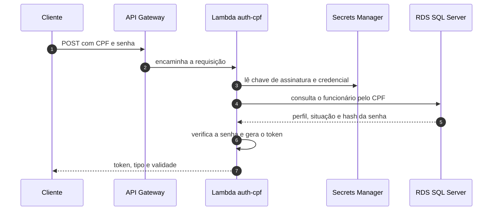
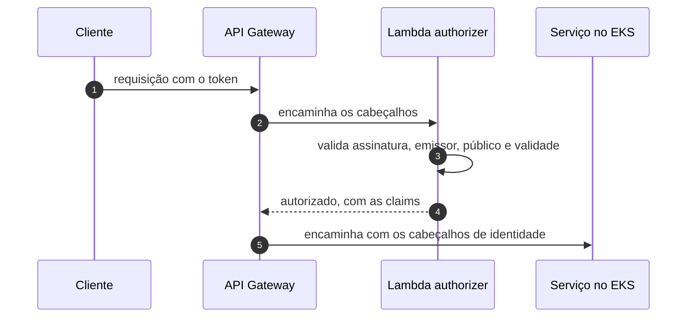

# oficina-auth-lambda

> Autenticação da solução Oficina: login por CPF e validação de token na borda da API.
> **.NET 10** · **AWS Lambda** · **Terraform** · **JWT HS256** · **GitHub Actions**

---

## A solução

A **Oficina** é uma plataforma de gestão de oficina mecânica distribuída em **6 repositórios** que compõem um único sistema na AWS. O cliente acessa uma API Gateway que autentica na borda e encaminha o tráfego para três microsserviços .NET 10 em EKS, que se comunicam por HTTP e por filas SQS FIFO e persistem em um RDS SQL Server compartilhado.

| Repositório | Responsabilidade |
|---|---|
| [oficina-infra-db](https://github.com/fabianorodrigues/oficina-infra-db-fiap-fase4) | Rede, banco de dados, segredos e estado do Terraform |
| [oficina-infra](https://github.com/fabianorodrigues/oficina-infra-fiap-fase4) | Plataforma EKS e entrypoint de API |
| **oficina-auth-lambda** *(este)* | Autenticação por CPF e emissão de token |
| [oficina-cadastro](https://github.com/fabianorodrigues/oficina-cadastro-fiap-fase4) | Clientes, veículos, funcionários e catálogo de serviços |
| [oficina-estoque](https://github.com/fabianorodrigues/oficina-estoque-fiap-fase4) | Peças, insumos, saldos e reservas |
| [oficina-ordens-servico](https://github.com/fabianorodrigues/oficina-ordens-servico-fiap-fase4) | Ordens de serviço, orçamento e saga de pagamento |

---

## Ordem de deploy

| # | Repositório | Workflow | Confirmação |
|---|---|---|---|
| 1 | oficina-infra-db | Database Infrastructure Deploy | `APPLY` |
| 2 | oficina-infra | Platform Deploy | `APPLY` |
| 3 | oficina-infra-db | Database Bootstrap | `BOOTSTRAP` |
| **4** | **oficina-auth-lambda** | **Auth Deploy** | `DEPLOY` |
| 5 | cadastro · estoque · ordens-servico | Deploy | `DEPLOY` |
| 6 | oficina-infra | Entrypoint Deploy | `APPLY` |
| 7 | oficina-infra | Observability Validate | `VALIDATE` |
| 8 | oficina-ordens-servico | AWS E2E Validate | `VALIDATE` |

> Este repositório é a **etapa 4**. Depende da rede e do segredo de banco criados na etapa 1, e precisa estar publicado antes da etapa 6, porque o entrypoint só consegue montar o autorizador se as duas funções já tiverem alias publicado.
>
> O login só funciona de ponta a ponta depois que a etapa 3 criar os bancos e a etapa 5 aplicar o esquema do cadastro, que é onde a tabela de funcionários vive.

---

## Responsabilidade

Duas funções Lambda independentes, com privilégios distintos:

| Função | Papel | Rede | Acesso a segredo |
|---|---|---|---|
| **auth-cpf** | Recebe CPF e senha, valida contra o banco e emite o token | Dentro da VPC, com saída apenas para o RDS | Chave de assinatura e credencial de banco |
| **authorizer** | Valida o token a cada requisição e devolve as claims à API Gateway | Fora da VPC | Apenas a chave de assinatura |

Ambas são publicadas com o alias `live`, que é o alvo estável referenciado pela API Gateway — a API nunca aponta para a versão mutável da função.

---

## Arquitetura

### Login por CPF



### Validação em cada requisição



---

## Contrato de segurança

| Item | Definição |
|---|---|
| **Algoritmo** | HS256, simétrico. Outros algoritmos são recusados, inclusive com verificação extra do cabeçalho do token |
| **Claims emitidas** | Identificador, CPF, perfil, nome, identificador do token e marcas de tempo |
| **Validação** | Emissor, público, validade, assinatura e presença obrigatória de todas as claims |
| **Senhas** | PBKDF2 com SHA-256 e no mínimo cem mil iterações; comparação em tempo fixo |
| **Chave de assinatura** | No mínimo 32 bytes; valores de exemplo e marcadores de posição são recusados |
| **CPF** | Normalizado e validado por dígito verificador; sempre mascarado nos logs |

Falhas de login retornam sempre a mesma resposta genérica, sem distinguir usuário inexistente, inativo ou senha incorreta. O autorizador **falha fechado**: qualquer erro resulta em acesso negado.

---

## Contrato de integração

### Consome

| Valor | Origem | Criado por |
|---|---|---|
| `/oficina/infra/vpc/id` | SSM | oficina-infra-db |
| `/oficina/infra/subnets/private/{1,2}` | SSM | oficina-infra-db |
| `/oficina/infra/rds/security-group-id` | SSM | oficina-infra-db |
| `/oficina/auth/database` | Secrets Manager | oficina-infra-db |

O deploy verifica os quatro parâmetros e exige que o segredo de banco já tenha uma versão corrente. Se faltar qualquer um, a execução aborta antes de compilar.

### Publica

| Valor | Caminho | Consumido por |
|---|---|---|
| Alias e nome da função de login | `/oficina/auth/cpf/{alias-arn,function-name}` | oficina-infra (entrypoint) |
| Alias e nome do autorizador | `/oficina/auth/authorizer/{alias-arn,function-name}` | oficina-infra (entrypoint) |
| Chave de assinatura | `/oficina/auth/jwt` | as duas funções, em tempo de execução |

O contêiner do segredo de assinatura é **criado por este repositório**; o valor é gravado pelo próprio Auth Deploy.

---

## Configuração

Configure em **Settings → Secrets and variables → Actions** do repositório.

### Secrets (obrigatórios)

| Secret | Uso |
|---|---|
| `AWS_ACCESS_KEY_ID` · `AWS_SECRET_ACCESS_KEY` · `AWS_SESSION_TOKEN` | Credenciais temporárias da AWS |
| `JWT_SIGNING_KEY` | Chave de assinatura do token |

A chave precisa ter **no mínimo 32 bytes**, não pode conter quebras de linha e é recusada se parecer um valor de exemplo. Gere uma chave forte com:

```bash
openssl rand -base64 48
```

O workflow aborta no primeiro passo se a chave não estiver configurada.

### Variables

| Variable | Obrigatória | Uso |
|---|---|---|
| `AWS_REGION` | **Sim** | Região das funções e dos segredos |
| `TF_STATE_BUCKET` | Não | Apenas compatibilidade com um bucket de estado pré-existente |

### O que é provisionado automaticamente

Todas as funções, papéis, grupos de log, o grupo de segurança e o contêiner do segredo de assinatura são criados pelo workflow. As variáveis do Terraform têm valor padrão, exceto a região, preenchida a partir de `AWS_REGION`.

As variáveis de ambiente das funções (emissor, público, validade do token, cache de segredo e nomes dos segredos) são definidas pelo Terraform e têm valor padrão no próprio código. Não há nada a configurar por variable do GitHub.

> **Pré-requisito não provisionado aqui:** o bucket S3 de estado do Terraform, criado na **etapa 1** pelo repositório [oficina-infra-db](https://github.com/fabianorodrigues/oficina-infra-db-fiap-fase4). O workflow verifica sua existência e falha se ele não existir.

---

## Executar pelo GitHub Actions

**Actions → Auth Deploy → Run workflow → `confirmation` = `DEPLOY`**

Roda apenas na branch `main` e a confirmação é **sensível a maiúsculas** — `deploy` em minúsculas é recusado.

Sequência: valida a requisição e a chave → confere os pré-requisitos da etapa 1 → compila, testa e empacota as duas funções → planeja e aplica o Terraform → **grava a chave de assinatura no Secrets Manager** → valida funções, alias e segredos → executa o teste de fumaça.

A gravação da chave acontece **dentro deste mesmo workflow**; não existe um pipeline separado de sincronização de segredo. A operação é idempotente: reexecutar com a mesma chave não cria nova versão do segredo.

Um passo de segurança **interrompe o deploy se o plano previr exclusão** de função, segredo, parâmetro ou papel IAM.

---

## Validar

### Pelo Console AWS

| Serviço | O que verificar |
|---|---|
| **Lambda** | Duas funções, cada uma com o alias `live` apontando para uma versão publicada |
| **Lambda → Configuração** | A função de login está associada às subnets privadas; o autorizador não tem VPC |
| **Secrets Manager** | `/oficina/auth/jwt` com uma versão corrente |
| **CloudWatch → Log groups** | Um grupo por função, com retenção de 14 dias |
| **Parameter Store** | 4 parâmetros sob `/oficina/auth/` |

### Pela AWS CLI

<details>
<summary>Comandos de validação</summary>

```bash
REGIAO=<sua-regiao>

# Nomes das funções, a partir do que foi publicado
FN_CPF=$(aws ssm get-parameter --name /oficina/auth/cpf/function-name \
  --region "$REGIAO" --query 'Parameter.Value' --output text)
FN_AUTZ=$(aws ssm get-parameter --name /oficina/auth/authorizer/function-name \
  --region "$REGIAO" --query 'Parameter.Value' --output text)

# O alias live precisa existir nas duas funções
aws lambda get-alias --function-name "$FN_CPF"  --name live --region "$REGIAO" \
  --query '{Alias:Name,Versao:FunctionVersion}' --output table
aws lambda get-alias --function-name "$FN_AUTZ" --name live --region "$REGIAO" \
  --query '{Alias:Name,Versao:FunctionVersion}' --output table

# Segredos com exatamente uma versão corrente
aws secretsmanager describe-secret --secret-id /oficina/auth/jwt \
  --region "$REGIAO" --query 'length(VersionIdsToStages)' --output text
```

</details>

### Validar o login pela API

Só é possível **após a etapa 6**, quando as rotas passam a existir, e com um funcionário já cadastrado. O caminho recomendado é o workflow **AWS E2E Validate** do repositório [oficina-ordens-servico](https://github.com/fabianorodrigues/oficina-ordens-servico-fiap-fase4), que executa o fluxo completo.

Ao validar manualmente, confira que um CPF inexistente e uma senha incorreta produzem **a mesma** resposta de credencial inválida, e nunca inclua token ou senha reais em relatórios ou capturas de tela.

---

## Executar e validar localmente

Não há emulador nem contêiner local: as funções são validadas por testes e pela análise estática. É o mesmo conjunto que a CI executa.

```bash
dotnet restore
dotnet build -c Release
dotnet test

# Empacota as duas funções em artifacts/lambda
pwsh ./scripts/package-lambdas.ps1

# Valida a chave de assinatura sem gravar nada na AWS
$env:JWT_SIGNING_KEY = "<chave-de-teste-com-32-bytes-ou-mais>"
pwsh ./scripts/sync-jwt-secret.ps1 -DryRun

# Terraform, sem acessar o estado remoto
cd terraform/auth
terraform fmt -check -recursive
terraform init -backend=false
terraform validate
```

O empacotamento precisa rodar antes de qualquer plano do Terraform: o stack calcula o hash dos arquivos compactados e falha se eles não existirem.

Em `samples/` há requisições de referência para as duas funções, com um CPF sintético.

---

## Limitações conhecidas

- **Escopo de autenticação reduzido.** Não há token de renovação, federação de identidade, múltiplo fator nem revogação imediata: um token permanece válido até expirar. Trocar a chave de assinatura invalida todos os tokens em circulação de uma só vez.
- **Emissão restrita a funcionários.** O login consulta a tabela de funcionários do cadastro; perfis de cliente não são emitidos por esta função.
- **Cobertura de integração ausente.** O projeto de testes de integração contém apenas um caso ignorado, que depende de um banco local. A cobertura real está nos testes de unidade.
- **Teste de fumaça superficial.** Na validação pós-deploy, o modo que invoca a função diretamente confirma apenas que a invocação ocorre, sem inspecionar a resposta.
- **Deploy sem aprovação manual** e **credenciais estáticas**, como nos demais repositórios de infraestrutura.

---

## Próxima etapa

Com as funções publicadas e o alias ativo, prossiga para a **etapa 5** e publique os três microsserviços (podem ser feitos em paralelo):

- **→ [oficina-cadastro](https://github.com/fabianorodrigues/oficina-cadastro-fiap-fase4)**
- **→ [oficina-estoque](https://github.com/fabianorodrigues/oficina-estoque-fiap-fase4)**
- **→ [oficina-ordens-servico](https://github.com/fabianorodrigues/oficina-ordens-servico-fiap-fase4)**
