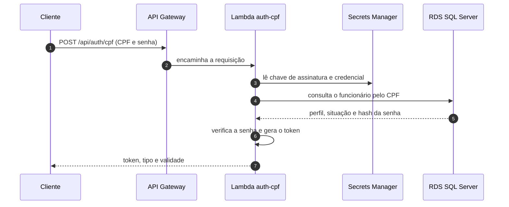
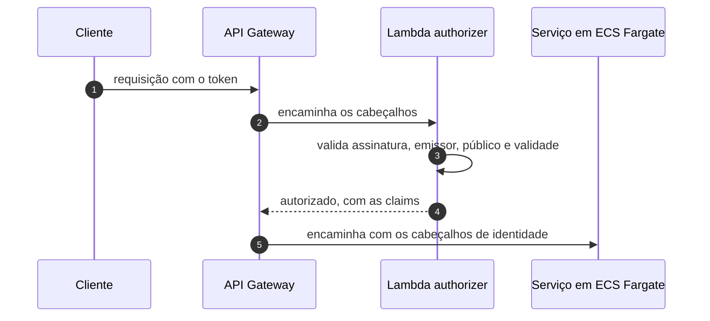

# oficina-auth-lambda

Autenticação da solução **Oficina**: login por CPF e validação de token JWT na borda da API.


---

## Sumário

- [Visão geral](#visão-geral)
- [Ordem de deploy da solução](#ordem-de-deploy-da-solução)
- [Arquitetura](#arquitetura)
- [Contrato de segurança](#contrato-de-segurança)
- [O que consome e o que publica](#o-que-consome-e-o-que-publica)
- [Configuração](#configuração)
- [Como executar](#como-executar)
- [Validação](#validação)
- [Execução local](#execução-local)
- [Limitações conhecidas](#limitações-conhecidas)
- [Próximas etapas](#próximas-etapas)

---

## Visão geral

A **Oficina** é uma plataforma de gestão de oficina mecânica implantada na AWS e distribuída em **6 repositórios** que compõem um único sistema. O cliente acessa uma **API Gateway HTTP**, que autentica na borda por uma **Lambda authorizer** e encaminha o tráfego, via **VPC Link**, para um **ALB interno** que roteia para três microsserviços **.NET 10 em ECS Fargate**. Os serviços se comunicam por HTTP interno e por filas **SQS FIFO**, e persistem em um **RDS SQL Server** compartilhado.

| Repositório | Responsabilidade | Etapas |
|---|---|:---:|
| [oficina-infra-db](https://github.com/fabianorodrigues/oficina-infra-db-fiap-fase4) | Rede, banco de dados, segredos e estado do Terraform | 1 e 3 |
| [oficina-infra](https://github.com/fabianorodrigues/oficina-infra-fiap-fase4) | Plataforma ECS/ALB e entrada de API | 2, 6 e 7 |
| **oficina-auth-lambda** *(este)* | Autenticação por CPF e validação de token | 4 |
| [oficina-cadastro](https://github.com/fabianorodrigues/oficina-cadastro-fiap-fase4) | Clientes, veículos, funcionários e catálogo de serviços | 5 |
| [oficina-estoque](https://github.com/fabianorodrigues/oficina-estoque-fiap-fase4) | Peças, insumos, saldos e reservas | 5 |
| [oficina-ordens-servico](https://github.com/fabianorodrigues/oficina-ordens-servico-fiap-fase4) | Ordens de serviço, orçamento e saga de pagamento | 5 e 8 |

**Papel deste repositório:** duas funções Lambda independentes que sustentam a segurança da solução.

| Função | Papel | Rede | Segredos |
|---|---|---|---|
| **auth-cpf** | Recebe CPF e senha, valida no banco e emite o token | Dentro da VPC, saída apenas para o RDS | Chave de assinatura e credencial de banco |
| **authorizer** | Valida o token a cada requisição e devolve as *claims* à API Gateway | Fora da VPC | Apenas a chave de assinatura |

Ambas são publicadas com o alias `live`, o alvo estável referenciado pela API Gateway — a API nunca aponta para a versão mutável da função.

---

## Ordem de deploy da solução

| # | Repositório | Workflow | Confirmação |
|:---:|---|---|:---:|
| 1 | oficina-infra-db | Database Infrastructure Deploy | `APPLY` |
| 2 | oficina-infra | Platform Deploy | `APPLY` |
| 3 | oficina-infra-db | Database Bootstrap | `BOOTSTRAP` |
| **4** | **oficina-auth-lambda** | **Auth Deploy** | `DEPLOY` |
| 5 | cadastro · estoque · ordens-servico | Deploy | `DEPLOY` |
| 6 | oficina-infra | Entrypoint Deploy | `APPLY` |
| 7 | oficina-infra | Observability Validate | — |
| 8 | oficina-ordens-servico | AWS E2E Validate | `VALIDATE` |

> [!IMPORTANT]
> Este repositório é a **etapa 4**. Depende da rede e do segredo de banco criados na etapa 1, e precisa estar publicado **antes da etapa 6**, porque o entrypoint só monta o autorizador se as duas funções já tiverem o alias `live` publicado. O login funciona de ponta a ponta somente após a etapa 3 criar os bancos e a etapa 5 aplicar o esquema do cadastro, onde vive a tabela de funcionários.

---

## Arquitetura

### Login por CPF



### Validação em cada requisição



---

## Contrato de segurança

| Item | Definição |
|---|---|
| **Algoritmo** | HS256, simétrico. Outros algoritmos são recusados, com verificação extra do cabeçalho do token |
| **Emissor / público** | `oficina` / `oficina-api`; validade padrão de 60 minutos |
| **Claims emitidas** | Identificador, CPF, perfil, nome, identificador do token e marcas de tempo |
| **Validação** | Emissor, público, validade, assinatura e presença obrigatória de todas as claims |
| **Senhas** | PBKDF2 com SHA-256 e no mínimo cem mil iterações; comparação em tempo fixo |
| **Chave de assinatura** | No mínimo 32 bytes; valores de exemplo são recusados |
| **CPF** | Normalizado e validado por dígito verificador; sempre mascarado nos logs |

Falhas de login retornam sempre a mesma resposta genérica, sem distinguir usuário inexistente, inativo ou senha incorreta. O autorizador **falha fechado**: qualquer erro resulta em acesso negado.

---

## O que consome e o que publica

### Consome

| Valor | Origem | Criado por |
|---|---|---|
| `/oficina/infra/vpc/id` | SSM | oficina-infra-db |
| `/oficina/infra/subnets/private/{1,2}` | SSM | oficina-infra-db |
| `/oficina/infra/rds/security-group-id` | SSM | oficina-infra-db |
| `/oficina/auth/database` | Secrets Manager | oficina-infra-db |

O deploy verifica os quatro valores e exige que o segredo de banco tenha uma versão corrente. Se faltar qualquer um, a execução aborta antes de compilar.

### Publica

| Valor | Caminho | Consumido por |
|---|---|---|
| Alias e nome da função de login | `/oficina/auth/cpf/{alias-arn,function-name}` | oficina-infra (entrypoint) |
| Alias e nome do autorizador | `/oficina/auth/authorizer/{alias-arn,function-name}` | oficina-infra (entrypoint) |
| Chave de assinatura | `/oficina/auth/jwt` (Secrets Manager) | as duas funções, em runtime |

O contêiner do segredo `/oficina/auth/jwt` é **criado por este repositório**; o valor é gravado pelo próprio Auth Deploy, de forma idempotente.

---

## Configuração

Configure em **Settings → Secrets and variables → Actions** do repositório.

### Secrets

| Secret | Uso | Obrigatório |
|---|---|:---:|
| `AWS_ACCESS_KEY_ID` · `AWS_SECRET_ACCESS_KEY` · `AWS_SESSION_TOKEN` | Credenciais temporárias da AWS | **Sim** |
| `JWT_SIGNING_KEY` | Chave de assinatura do token (mínimo 32 bytes, sem quebras de linha) | **Sim** |

Gere uma chave forte com `openssl rand -base64 48`. O workflow aborta no primeiro passo se a chave não estiver configurada ou parecer um valor de exemplo.

### Variables

| Variable | Uso | Obrigatório |
|---|---|:---:|
| `AWS_REGION` | Região das funções e dos segredos | **Sim** |
| `AUTH_CPF_ROLE_ARN` | ARN da role de execução da Lambda **auth-cpf** | **Sim** |
| `AUTHORIZER_ROLE_ARN` | ARN da role de execução da Lambda **authorizer** | **Sim** |
| `TF_STATE_BUCKET` | Compatibilidade com um bucket de estado pré-existente | Não |

### Papéis IAM das Lambdas — não provisionados automaticamente

Este deploy **não cria papéis IAM**: ele reutiliza roles externas e um passo de segurança **bloqueia o plano** se detectar criação de role. As duas roles **precisam existir antes da etapa 4** e ser informadas em `AUTH_CPF_ROLE_ARN` e `AUTHORIZER_ROLE_ARN`.

| Variable | Trust | Permissões mínimas |
|---|---|---|
| `AUTH_CPF_ROLE_ARN` | `lambda.amazonaws.com` | `AWSLambdaBasicExecutionRole` · `AWSLambdaVPCAccessExecutionRole` · `secretsmanager:GetSecretValue` nos segredos `/oficina/auth/jwt` e `/oficina/auth/database` |
| `AUTHORIZER_ROLE_ARN` | `lambda.amazonaws.com` | `AWSLambdaBasicExecutionRole` · `secretsmanager:GetSecretValue` no segredo `/oficina/auth/jwt` |

> [!NOTE]
> A função **auth-cpf** roda dentro da VPC (por isso exige acesso VPC na role); o **authorizer** roda fora da VPC. Se as variáveis não forem configuradas, o workflow falha com a mensagem `Repository Variable AUTH_CPF_ROLE_ARN is required to reuse existing Lambda execution roles`.

### O que é provisionado automaticamente

As duas funções, os grupos de log, o grupo de segurança e o contêiner do segredo `/oficina/auth/jwt` são criados pelo workflow. As variáveis de ambiente das funções (emissor, público, validade e nomes dos segredos) têm valor padrão no Terraform e não precisam ser configuradas.

> [!WARNING]
> **Pré-requisito não provisionado aqui:** o bucket S3 de estado do Terraform, criado na **etapa 1** por [oficina-infra-db](https://github.com/fabianorodrigues/oficina-infra-db-fiap-fase4). O workflow verifica sua existência e falha se ele não existir.

---

## Como executar

**Actions → Auth Deploy → Run workflow → `confirmation` = `DEPLOY`**

Roda apenas na branch `main`; a confirmação é **sensível a maiúsculas**.

Sequência: valida a requisição, a chave e as duas roles → confere os pré-requisitos da etapa 1 → compila, testa e empacota as duas funções → planeja e aplica o Terraform → **grava a chave de assinatura no Secrets Manager** → valida funções, alias e segredos → executa o teste de fumaça. Um passo de segurança **interrompe o deploy se o plano previr exclusão** de função, segredo, parâmetro ou papel IAM, **ou criação de novo papel IAM**.

---

## Validação

### Pelo Console AWS

| Serviço | O que verificar |
|---|---|
| **Lambda** | Duas funções, cada uma com o alias `live` apontando para uma versão publicada |
| **Lambda → Configuração** | `auth-cpf` associada às subnets privadas; `authorizer` sem VPC |
| **Secrets Manager** | `/oficina/auth/jwt` com uma versão corrente |
| **CloudWatch → Log groups** | Um grupo por função, retenção de 14 dias |
| **Parameter Store** | 4 parâmetros sob `/oficina/auth/` |

### Pela AWS CLI

<details>
<summary>Comandos de validação</summary>

```bash
REGIAO=<sua-regiao>

FN_CPF=$(aws ssm get-parameter --name /oficina/auth/cpf/function-name \
  --region "$REGIAO" --query 'Parameter.Value' --output text)
FN_AUTZ=$(aws ssm get-parameter --name /oficina/auth/authorizer/function-name \
  --region "$REGIAO" --query 'Parameter.Value' --output text)

# O alias live precisa existir nas duas funções
aws lambda get-alias --function-name "$FN_CPF"  --name live --region "$REGIAO" \
  --query '{Alias:Name,Versao:FunctionVersion}' --output table
aws lambda get-alias --function-name "$FN_AUTZ" --name live --region "$REGIAO" \
  --query '{Alias:Name,Versao:FunctionVersion}' --output table

# Segredo de assinatura com uma versão corrente
aws secretsmanager describe-secret --secret-id /oficina/auth/jwt \
  --region "$REGIAO" --query 'length(VersionIdsToStages)' --output text
```

</details>

O login de ponta a ponta só pode ser exercitado **após a etapa 6**, com um funcionário cadastrado. O caminho recomendado é o **AWS E2E Validate** do repositório [oficina-ordens-servico](https://github.com/fabianorodrigues/oficina-ordens-servico-fiap-fase4). Ao validar manualmente, confirme que um CPF inexistente e uma senha incorreta produzem **a mesma** resposta de credencial inválida, e nunca inclua token ou senha reais em relatórios.

---

## Execução local

Não há emulador local: as funções são validadas por testes e análise estática, o mesmo conjunto que a CI executa.

```bash
dotnet restore
dotnet build -c Release
dotnet test

# Empacota as duas funções em artifacts/lambda
pwsh ./scripts/package-lambdas.ps1

# Valida a chave de assinatura sem gravar nada na AWS
$env:JWT_SIGNING_KEY = "<chave-de-teste-com-32-bytes-ou-mais>"
pwsh ./scripts/sync-jwt-secret.ps1 -DryRun

# Terraform, sem acessar o estado remoto
cd terraform/auth
terraform fmt -check -recursive
terraform init -backend=false
terraform validate
```

O empacotamento precisa rodar antes de qualquer plano do Terraform: o stack calcula o hash dos arquivos compactados e falha se eles não existirem. Em `samples/` há requisições de referência com um CPF sintético.

---

## Limitações conhecidas

- **Escopo de autenticação reduzido.** Sem token de renovação, federação, múltiplo fator ou revogação imediata: um token vale até expirar.
- **Emissão restrita a funcionários.** O login consulta a tabela de funcionários do cadastro; perfis de cliente não são emitidos aqui.
- **Cobertura de integração ausente.** A cobertura real está nos testes de unidade; o caso de integração depende de um banco local e fica ignorado.
- **Deploy sem aprovação manual** e **credenciais estáticas**, como nos demais repositórios de infraestrutura.

---

## Próximas etapas

Com as funções publicadas e o alias `live` ativo, prossiga para a **etapa 5** e publique os três microsserviços (podem rodar em paralelo):

- **→ [oficina-cadastro](https://github.com/fabianorodrigues/oficina-cadastro-fiap-fase4)**
- **→ [oficina-estoque](https://github.com/fabianorodrigues/oficina-estoque-fiap-fase4)**
- **→ [oficina-ordens-servico](https://github.com/fabianorodrigues/oficina-ordens-servico-fiap-fase4)**
