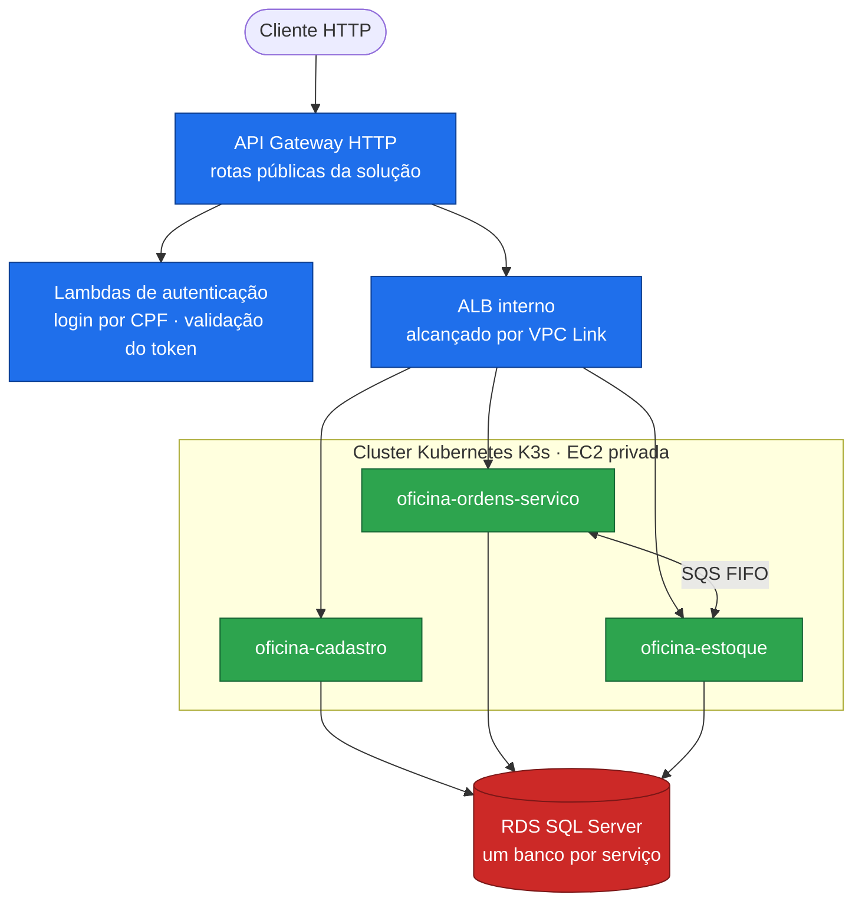
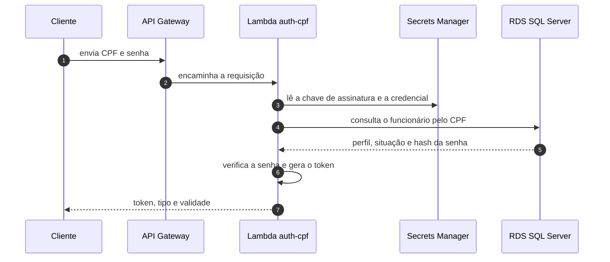
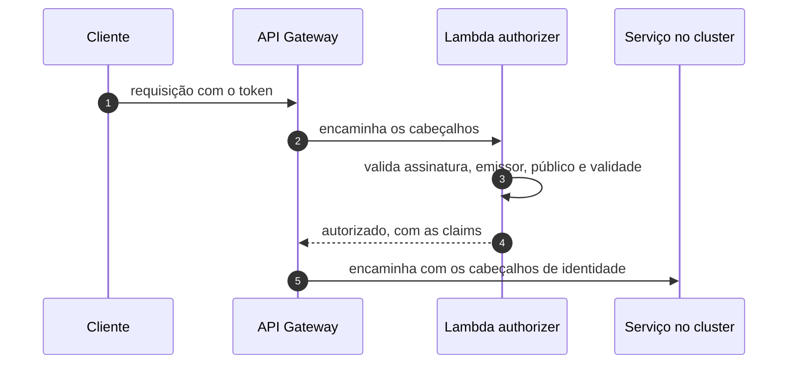

<h1 align="center">Oficina · Autenticação</h1>

<p align="center">
  Autenticação da solução <strong>Oficina</strong>: login por CPF e validação do token
  em cada requisição, na borda da API.
</p>

<p align="center">
  
  
  
  
  
  
</p>

---

## Sumário

- [Responsabilidade](#responsabilidade)
- [Solução integrada](#solução-integrada)
- [Ordem de deploy](#ordem-de-deploy)
- [Arquitetura](#arquitetura)
- [Pré-requisitos manuais](#pré-requisitos-manuais)
- [Contratos consumidos e publicados](#contratos-consumidos-e-publicados)
- [Como configurar](#como-configurar)
- [Como executar](#como-executar)
- [Como validar](#como-validar)
- [Validação local](#validação-local)
- [Próxima etapa](#próxima-etapa)

---

## Responsabilidade

Duas funções Lambda independentes que sustentam a segurança da solução, publicadas na **etapa 4**.

| Função | Papel | Rede | Segredos que lê |
|---|---|---|---|
| **auth-cpf** | Recebe CPF e senha, valida no banco e emite o token | Dentro da VPC, com saída apenas para o banco | Chave de assinatura e credencial de leitura do banco |
| **authorizer** | Valida o token a cada requisição e devolve as *claims* à API Gateway | Fora da VPC | Apenas a chave de assinatura |

Ambas são publicadas com o alias `live`, o alvo estável referenciado pela API Gateway — a borda nunca aponta para a versão mutável da função.

### Contrato de segurança

| Item | Definição |
|---|---|
| Algoritmo | HS256 simétrico; outros algoritmos são recusados, com verificação extra do cabeçalho do token |
| Emissor e público | Fixos na configuração, com validade padrão de 60 minutos |
| Claims emitidas | Identificador, CPF, perfil, nome, identificador do token e marcas de tempo |
| Validação | Emissor, público, validade, assinatura e presença obrigatória de todas as claims |
| Senhas | PBKDF2 com SHA-256 e no mínimo cem mil iterações, com comparação em tempo fixo |
| Chave de assinatura | No mínimo 32 bytes; valores de exemplo são recusados no deploy |
| CPF | Normalizado, validado por dígito verificador e sempre mascarado nos logs |

Falhas de login retornam sempre a mesma resposta genérica, sem distinguir usuário inexistente, inativo ou senha incorreta. O autorizador **falha fechado**: qualquer erro resulta em acesso negado.

---

## Solução integrada

A **Oficina** é uma plataforma de gestão de oficina mecânica implantada na AWS e distribuída em **6 repositórios que formam um único sistema**. O cliente acessa uma **API Gateway HTTP**, autenticada na borda por **Lambdas**; o tráfego segue por **VPC Link** até um **ALB interno**, que roteia para três microsserviços **.NET 10** em **Kubernetes (K3s)**. Os serviços conversam por HTTP interno e por **filas SQS FIFO**, e persistem em um **RDS SQL Server** com um banco isolado por serviço.


```mermaid
flowchart TB
    Cliente([Cliente HTTP])
    Gateway["API Gateway HTTP<br/>rotas públicas da solução"]
    Auth["Lambdas de autenticação<br/>login por CPF · validação do token"]
    ALB["ALB interno<br/>alcançado por VPC Link"]

    subgraph Cluster["Cluster Kubernetes K3s · EC2 privada"]
        direction LR
        Cadastro["oficina-cadastro"]
        Ordens["oficina-ordens-servico"]
        Estoque["oficina-estoque"]
    end

    Banco[("RDS SQL Server<br/>um banco por serviço")]

    Cliente --> Gateway
    Gateway --> Auth
    Gateway --> ALB
    ALB --> Cadastro
    ALB --> Ordens
    ALB --> Estoque
    Ordens <-->|"SQS FIFO"| Estoque
    Cadastro --> Banco
    Ordens --> Banco
    Estoque --> Banco

    classDef borda fill:#1f6feb,stroke:#0b3d91,color:#fff
    classDef servico fill:#2da44e,stroke:#166534,color:#fff
    classDef dados fill:#CC2927,stroke:#7a1717,color:#fff
    class Gateway,Auth,ALB borda
    class Cadastro,Ordens,Estoque servico
    class Banco dados
```

| Repositório | Responsabilidade | Etapas |
|---|---|:---:|
| [oficina-infra-db](https://github.com/fabianorodrigues/oficina-infra-db-fiap-fase4) | Rede, banco de dados, segredos, estado do Terraform e administrador inicial | 1 · 3 · 6 |
| [oficina-infra](https://github.com/fabianorodrigues/oficina-infra-fiap-fase4) | Plataforma Kubernetes/ALB, entrada pública da API e observabilidade | 2 · 9 · 10 |
| **oficina-auth-lambda** *(este)* | Autenticação por CPF e validação de token na borda | 4 |
| [oficina-cadastro](https://github.com/fabianorodrigues/oficina-cadastro-fiap-fase4) | Clientes, veículos, funcionários e catálogo de serviços | 5 |
| [oficina-estoque](https://github.com/fabianorodrigues/oficina-estoque-fiap-fase4) | Peças, insumos, saldos e reservas | 7 |
| [oficina-ordens-servico](https://github.com/fabianorodrigues/oficina-ordens-servico-fiap-fase4) | Ordens de serviço, orçamento e saga de pagamento | 8 · 11 |

---

## Ordem de deploy

| # | Repositório | Workflow | Confirmação |
|:---:|---|---|:---:|
| 1 | oficina-infra-db | Database Infrastructure Deploy | `APPLY` |
| 2 | oficina-infra | Platform Deploy | `APPLY` |
| 3 | oficina-infra-db | Database Bootstrap | `BOOTSTRAP` |
| **4** | **oficina-auth-lambda** *(este)* | **Auth Deploy** | `DEPLOY` |
| 5 | oficina-cadastro | Cadastro Deploy | `DEPLOY` |
| 6 | oficina-infra-db | Initial Admin Provision | `PROVISION_ADMIN` |
| 7 | oficina-estoque | Estoque Deploy | `DEPLOY` |
| 8 | oficina-ordens-servico | Ordens Deploy | `DEPLOY` |
| 9 | oficina-infra | Entrypoint Deploy | `APPLY` |
| 10 | oficina-infra | Observability Deploy | `DEPLOY` |
| 11 | oficina-ordens-servico | Collection Postman (manual) | — |

> [!IMPORTANT]
> Este repositório depende da rede e do segredo de banco da etapa 1, e precisa estar publicado **antes da etapa 9**: o entrypoint só monta o autorizador quando as duas funções já têm o alias `live`. O login funciona de ponta a ponta somente depois que a etapa 5 aplica o esquema do cadastro e a etapa 6 provisiona o administrador inicial.

---

## Arquitetura

### Login por CPF


```mermaid
sequenceDiagram
    autonumber
    participant C as Cliente
    participant G as API Gateway
    participant L as Lambda auth-cpf
    participant S as Secrets Manager
    participant D as RDS SQL Server

    C->>G: envia CPF e senha
    G->>L: encaminha a requisição
    L->>S: lê a chave de assinatura e a credencial
    L->>D: consulta o funcionário pelo CPF
    D-->>L: perfil, situação e hash da senha
    L->>L: verifica a senha e gera o token
    L-->>C: token, tipo e validade
```

### Validação em cada requisição


```mermaid
sequenceDiagram
    autonumber
    participant C as Cliente
    participant G as API Gateway
    participant A as Lambda authorizer
    participant S as Serviço no cluster

    C->>G: requisição com o token
    G->>A: encaminha os cabeçalhos
    A->>A: valida assinatura, emissor, público e validade
    A-->>G: autorizado, com as claims
    G->>S: encaminha com os cabeçalhos de identidade
```

---

## Pré-requisitos manuais

| Pré-requisito | Onde configurar | Comportamento sem configuração |
|---|---|---|
| Credenciais temporárias da AWS | Secrets deste repositório | O workflow falha na autenticação |
| Região da AWS | Variable `AWS_REGION` | O workflow aborta na validação inicial |
| Chave de assinatura do token | Secret `JWT_SIGNING_KEY` | O workflow aborta no primeiro passo |
| **Roles de execução das duas Lambdas** | Variables `AUTH_CPF_ROLE_ARN` e `AUTHORIZER_ROLE_ARN` | O workflow aborta: `Repository Variable AUTH_CPF_ROLE_ARN is required to reuse existing Lambda execution roles` |
| Bucket S3 de estado do Terraform | Criado na etapa 1 por [oficina-infra-db](https://github.com/fabianorodrigues/oficina-infra-db-fiap-fase4) | O workflow verifica a existência do bucket e falha |

### Roles das Lambdas — obrigatórias e não provisionadas

Este deploy **não cria papéis IAM**, e um passo de segurança **bloqueia o plano** se detectar criação de role. As duas roles precisam existir antes da etapa 4.

| Variable | Trust policy | Permissões mínimas |
|---|---|---|
| `AUTH_CPF_ROLE_ARN` | `lambda.amazonaws.com` | `AWSLambdaBasicExecutionRole` · `AWSLambdaVPCAccessExecutionRole` · `secretsmanager:GetSecretValue` nos segredos `/oficina/auth/jwt` e `/oficina/auth/database` |
| `AUTHORIZER_ROLE_ARN` | `lambda.amazonaws.com` | `AWSLambdaBasicExecutionRole` · `secretsmanager:GetSecretValue` no segredo `/oficina/auth/jwt` |

A função **auth-cpf** roda dentro da VPC, por isso exige a política de acesso a VPC; o **authorizer** roda fora da VPC. Consulte o ARN de uma role existente com:

```bash
aws iam get-role --role-name "<nome-da-role>" --query 'Role.Arn' --output text
```

### Chave de assinatura

Gere uma chave forte e grave-a no Secret `JWT_SIGNING_KEY`, sem quebras de linha:

```bash
openssl rand -base64 48
```

O workflow recusa chaves com menos de 32 bytes e valores que pareçam exemplo.

---

## Contratos consumidos e publicados

### Consome

| Valor | Origem | Criado por |
|---|---|---|
| VPC | `/oficina/infra/vpc/id` | oficina-infra-db |
| Subnets privadas | `/oficina/infra/subnets/private/{1,2}` | oficina-infra-db |
| Grupo de segurança do RDS | `/oficina/infra/rds/security-group-id` | oficina-infra-db |
| Credencial de leitura do banco | `/oficina/auth/database` (Secrets Manager) | oficina-infra-db |

O deploy verifica os quatro valores e exige que o segredo de banco tenha uma versão corrente. Se faltar qualquer um, a execução aborta antes de compilar.

### Publica

| Valor | Caminho | Consumido por |
|---|---|---|
| Alias e nome da função de login | `/oficina/auth/cpf/{alias-arn,function-name}` | oficina-infra (entrypoint) |
| Alias e nome do autorizador | `/oficina/auth/authorizer/{alias-arn,function-name}` | oficina-infra (entrypoint) |
| Chave de assinatura | `/oficina/auth/jwt` (Secrets Manager) | as duas funções, em tempo de execução |

O contêiner do segredo `/oficina/auth/jwt` é criado por este repositório, e o valor é gravado pelo próprio deploy de forma idempotente.

---

## Como configurar

Configure em **Settings → Secrets and variables → Actions** deste repositório.

### Secrets

| Secret | Uso | Obrigatório |
|---|---|:---:|
| `AWS_ACCESS_KEY_ID` · `AWS_SECRET_ACCESS_KEY` · `AWS_SESSION_TOKEN` | Credenciais temporárias da AWS | **Sim** |
| `JWT_SIGNING_KEY` | Chave de assinatura do token | **Sim** |

### Variables

| Variable | Uso | Obrigatório | Padrão quando vazia |
|---|---|:---:|---|
| `AWS_REGION` | Região das funções e dos segredos | **Sim** | — |
| `AUTH_CPF_ROLE_ARN` | Role de execução da Lambda de login | **Sim** | — |
| `AUTHORIZER_ROLE_ARN` | Role de execução do autorizador | **Sim** | — |
| `TF_STATE_BUCKET` | Compatibilidade com um bucket de estado pré-existente com outro nome | Não | Nome determinístico da etapa 1 |

### O que é provisionado automaticamente

As duas funções, seus grupos de log, o grupo de segurança e o contêiner do segredo da chave de assinatura são criados pelo workflow. Emissor, público, validade e nomes dos segredos têm valor padrão no Terraform e não precisam ser configurados.

---

## Como executar

**Actions → Auth Deploy → Run workflow → `confirmation` = `DEPLOY`**

Roda apenas na branch `main`; a confirmação é **sensível a maiúsculas**.

Sequência: valida a requisição, a chave e as duas roles → confere os pré-requisitos da etapa 1 → compila, testa e empacota as duas funções → planeja e aplica o Terraform → grava a chave de assinatura no Secrets Manager → valida funções, aliases e segredos → executa o teste de fumaça.

Um passo de segurança **interrompe o deploy se o plano previr exclusão** de função, segredo, parâmetro ou papel IAM, **ou criação de novo papel IAM**.

---

## Como validar

### Pelo Console AWS

| Serviço | O que verificar |
|---|---|
| **Lambda** | Duas funções, cada uma com o alias `live` apontando para uma versão publicada |
| **Lambda → Configuração** | Função de login associada às subnets privadas; autorizador sem VPC |
| **Secrets Manager** | Segredo da chave de assinatura com uma versão corrente |
| **CloudWatch → Log groups** | Um grupo por função, com retenção de 14 dias |
| **Parameter Store** | 4 parâmetros sob `/oficina/auth/` |

### Pela AWS CLI

<details>
<summary>Comandos de validação</summary>

```bash
REGIAO=<sua-regiao>

FN_CPF=$(aws ssm get-parameter --name /oficina/auth/cpf/function-name \
  --region "$REGIAO" --query 'Parameter.Value' --output text)
FN_AUTZ=$(aws ssm get-parameter --name /oficina/auth/authorizer/function-name \
  --region "$REGIAO" --query 'Parameter.Value' --output text)

# O alias live precisa existir nas duas funções
aws lambda get-alias --function-name "$FN_CPF"  --name live --region "$REGIAO" \
  --query '{Alias:Name,Versao:FunctionVersion}' --output table
aws lambda get-alias --function-name "$FN_AUTZ" --name live --region "$REGIAO" \
  --query '{Alias:Name,Versao:FunctionVersion}' --output table

# Segredo de assinatura com exatamente uma versão corrente
aws secretsmanager describe-secret --secret-id /oficina/auth/jwt \
  --region "$REGIAO" --query 'length(VersionIdsToStages)' --output text
```

</details>

O login de ponta a ponta é validado na **etapa 11**, pela collection Postman em [oficina-ordens-servico](https://github.com/fabianorodrigues/oficina-ordens-servico-fiap-fase4#etapa-11--collection-postman), cuja primeira requisição é exatamente o login por CPF.

Em uma verificação manual, confirme que um CPF inexistente e uma senha incorreta produzem **a mesma** resposta de credencial inválida, e nunca inclua token ou senha reais em relatórios.

---

## Validação local

Não há emulador local: as funções são validadas por testes e análise estática, o mesmo conjunto que a CI executa.

```bash
dotnet restore
dotnet build -c Release
dotnet test

# Terraform, sem acessar o estado remoto
cd terraform/auth
terraform fmt -check -recursive
terraform init -backend=false
terraform validate
```

Empacotamento e verificação da chave, no PowerShell:

```powershell
# Empacota as duas funções em artifacts/lambda
./scripts/package-lambdas.ps1

# Valida a chave de assinatura sem gravar nada na AWS
$env:JWT_SIGNING_KEY = '<chave-de-teste-com-32-bytes-ou-mais>'
./scripts/sync-jwt-secret.ps1 -DryRun
```

O empacotamento precisa rodar antes de qualquer plano do Terraform: o stack calcula o hash dos arquivos compactados e falha se eles não existirem. Em `samples/` há requisições de referência com dados sintéticos.

---

## Próxima etapa

**Etapa 5 — obrigatória.** Pré-condição: as duas funções publicadas com o alias `live` e os 4 parâmetros sob `/oficina/auth/` disponíveis.

**→ [oficina-cadastro](https://github.com/fabianorodrigues/oficina-cadastro-fiap-fase4#como-executar)** — publica o primeiro microsserviço e cria a tabela de funcionários.

Concluída a etapa 5, execute a **etapa 6** em [oficina-infra-db](https://github.com/fabianorodrigues/oficina-infra-db-fiap-fase4#etapa-6) para provisionar o administrador inicial exigido pela validação funcional.
